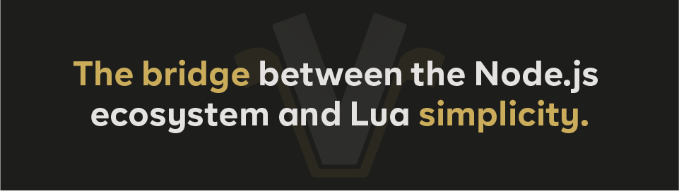

[](https://vercordjs.org/)

<br />

<p align=center>
  <a href="https://vercordjs.org/"></a>
  <a href="https://discord.gg/yHmwhNWaQj"></a>
</p>

<br />

A JavaScript framework that serves as a bridge to Lua, offering a robust and intuitive solution for creating applications. It automates complex tasks on the JavaScript side, allowing you to focus on developing your features entirely in Lua, with confidence.

```bash
npx @vercord-js/cli init <project-name>
```

## 📖 Documentation

The documentation is available on [Vercordjs.org](https://vercordjs.org/).

## 🤝 Contribution

We welcome your support to enhance Vercordjs. To do that you can report bugs or give us feedback and ideas.
